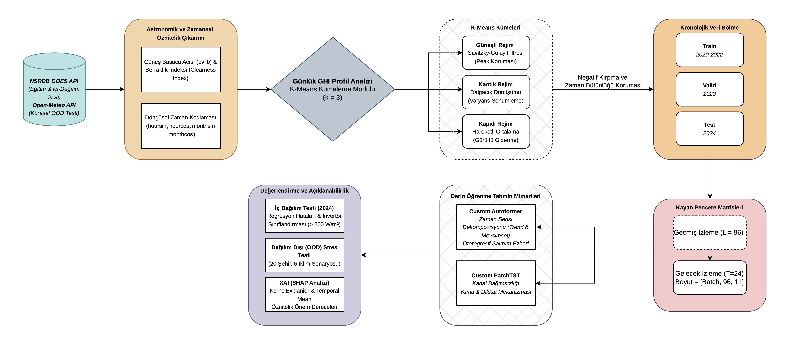

# Regime-Aware Adaptive Signal Filtering for Transformer-Based Solar Irradiance Forecasting


---

##  Overview

This project proposes an end-to-end pipeline for **Global Horizontal Irradiance (GHI) forecasting** by combining

- 🌤️ Regime-aware adaptive signal filtering
- 🤖 Transformer-based deep learning
- ☀️ Astronomical feature engineering
- 📈 Explainable AI (SHAP)
- 🌍 Out-of-Distribution (OOD) generalization analysis

The pipeline automatically identifies daily weather regimes and applies the most appropriate signal processing technique before training Transformer models.

---

#  Project Structure

```
.
├── notebooks/
│   ├── 01_data_acquisition.ipynb
│   ├── 02_03_eda_analysis.ipynb
│   ├── 04_model_training.ipynb
│   ├── 05_model_results.ipynb
│   ├── 06_xai_evaluation.ipynb
│   └── 07_ood_generalization.ipynb
│
├── outputs/
│   ├── plots/
│   └── reports/
│
├── src/
│   ├── __init__.py
│   ├── data_loader.py
│   ├── filters.py
│   └── utils.py
│
├── models/
│
├── requirements.txt
└── README.md
```

---

#  Pipeline



---

# 🔬 Signal Processing

The preprocessing stage applies different filters depending on the detected weather regime.

| Regime | Filter |
|---------|--------|
| ☀️ Sunny | Savitzky-Golay |
| ☁️ Cloudy | Moving Average |
| ⛈️ Chaotic | Wavelet Transform |

---

#  Models

Current deep learning models include

- Custom PatchTST
- Custom Autoformer

Future models may include

- Informer
- iTransformer
- DLinear
- TimesNet

---

#  Explainability

The project includes

- SHAP feature importance
- Temporal explanations
- Model interpretation
- Feature contribution analysis

---

#  OOD Evaluation

Models are evaluated on multiple unseen geographical locations to measure

- Generalization
- Robustness
- Climate transferability

---

#  Installation

```bash
git clone <repository_url>

cd repository

pip install -r requirements.txt
```

---

# ▶ Workflow

Run notebooks sequentially.

```
01_data_acquisition.ipynb
        ↓
02_03_eda_analysis.ipynb
        ↓
04_model_training.ipynb
        ↓
05_model_results.ipynb
        ↓
06_xai_evaluation.ipynb
        ↓
07_ood_generalization.ipynb
```

---

#  Main Libraries

- PyTorch
- NumPy
- Pandas
- SciPy
- PyWavelets
- Scikit-Learn
- pvlib
- SHAP
- Matplotlib
- Jupyter Notebook

---

#  Citation

If you use this project in your research, please cite the corresponding publication.

---

#  Author

**Melih Yiğit Kotman**

Department of Computer Engineering

Bolu Abant İzzet Baysal University